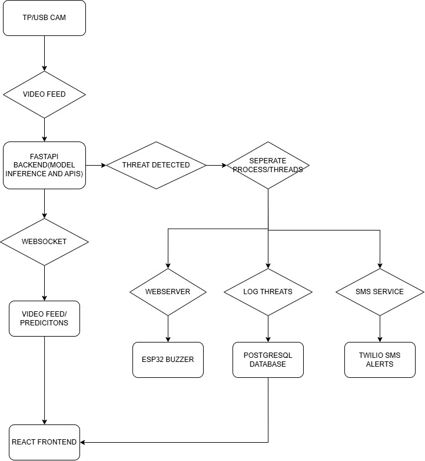
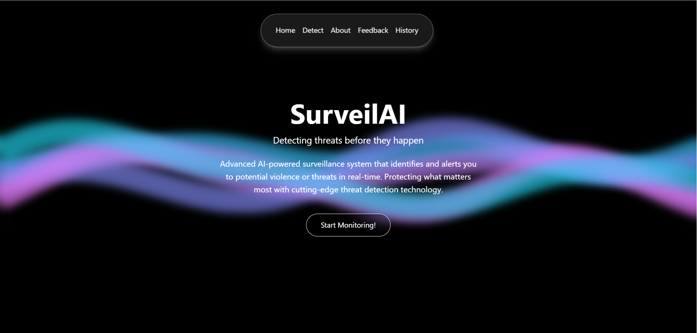
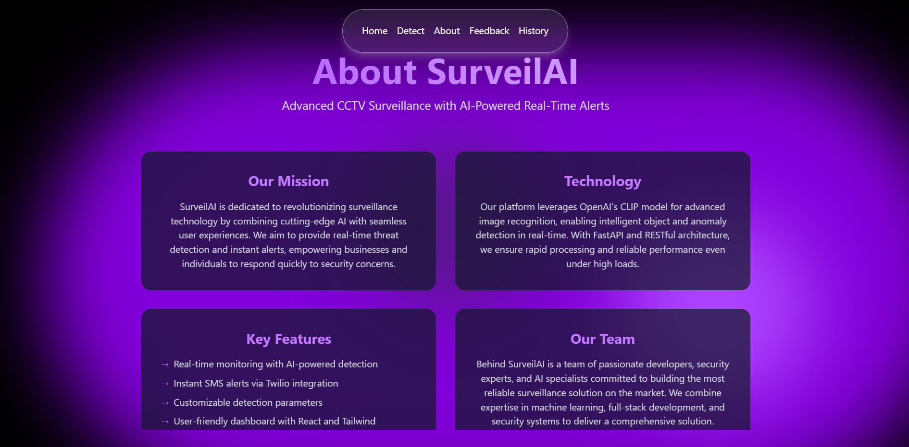

# 🚀 **SurveilAI: Automated Video Analysis for Surveillance** 🎥🔍  
SurveilAI is an AI-powered video surveillance system designed to enhance security through automated video analysis.  
It leverages OpenAI’s CLIP model, OpenCV, and Twilio to detect and alert authorities about potential security threats in real time.  
Future integrations include IoT-based alerting for even more proactive surveillance.  

-------------------------------------------------------------
✨ FEATURES  
-------------------------------------------------------------

✅ Real-Time Video Analysis – Uses OpenAI's CLIP model for intelligent scene interpretation.  
✅ Object and Activity Detection – Recognizes suspicious activities and predefined security concerns.  
✅ Automated Alerts – Instantly notifies concerned authorities via Twilio SMS.  
✅ Web Interface – ReactJS-powered UI for live monitoring and historical data visualization.  
✅ Customizable Event Triggers – Configure specific events for alerting.  
✅ Scalability & Future IoT Integration – Plans for IoT devices to enhance real-world monitoring.  

-------------------------------------------------------------
🏗️ TECH STACK  
-------------------------------------------------------------

Frontend: ReactJS  
Backend: FastAPI (Python)  
AI Model: OpenAI CLIP, OpenCV  
Alerting System: Twilio SMS API  
Database: PostgreSQL  
Future Integration: IoT-based Alerting System  

-------------------------------------------------------------
🖥️ SYSTEM ARCHITECTURE  
-------------------------------------------------------------
<p align="center">
  
</p>

-------------------------------------------------------------

## 🎥 **DEMO**  

<p align="center">
  
</p>  

<p align="center">
  
</p>  
  

-------------------------------------------------------------
🚀 INSTALLATION & SETUP  
-------------------------------------------------------------

📌 PREREQUISITES:  
- Python 3.8+  
- Node.js & npm  
- PostgreSQL  
- Twilio API Credentials  

⚙️ BACKEND SETUP:  
1. Clone the repository:  
   ```bash 
   git clone https://github.com/your-repo/SurveilAI.git  
   ```
2. Navigate to the backend:  
    ```bash
   cd SurveilAI/backend 
   ```  
3. Install dependencies:  
   ```bash
    pip install -r requirements.txt 
    ``` 
4. Run the backend server:  
   ```bash 
   uvicorn main:app --reload 
   ``` 

🎨 FRONTEND SETUP:  
1. Navigate to the frontend:  
   ```bash 
   cd ../frontend/SurveilAI 
   ```
2. Install dependencies:  
   ```bash 
   npm install  
   ```
3. Start the development server:  
   ```bash 
   npm run dev 
   ``` 

-------------------------------------------------------------
📢 FUTURE ENHANCEMENTS  
-------------------------------------------------------------

🚀 IoT-based Smart Alerts – Integrate IoT sensors for real-world security automation.  
📈 Machine Learning Improvements – Enhance accuracy using more robust AI models.  
🌐 Cloud Deployment – Host on AWS/GCP for large-scale surveillance.  

-------------------------------------------------------------                 
<p align="center">
    <strong><h2>Built with ❤️ by Pull Request Party 🚀</h2></strong>
</p>

---------------------------------------------------------------
